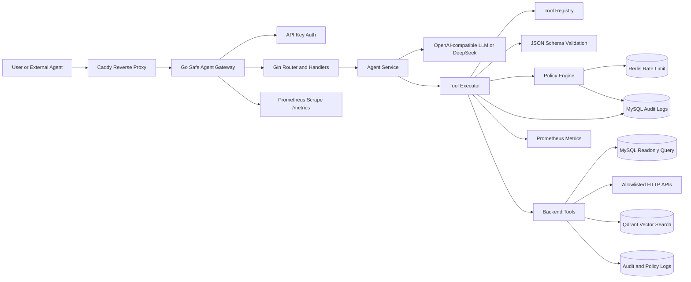
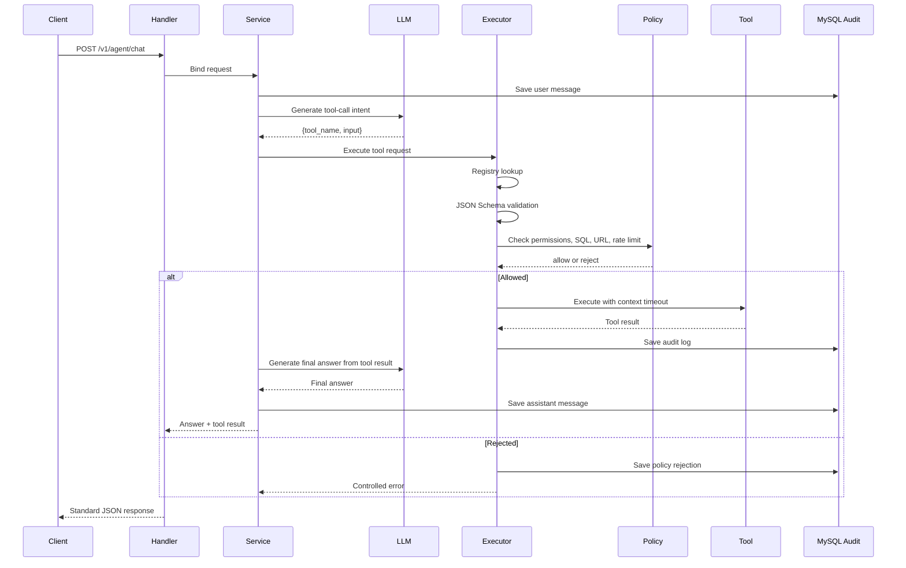
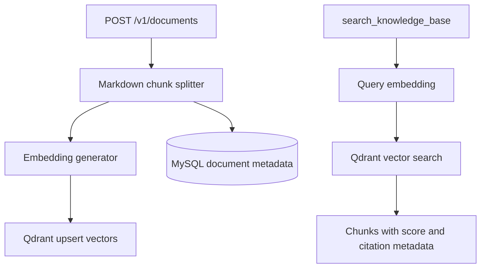
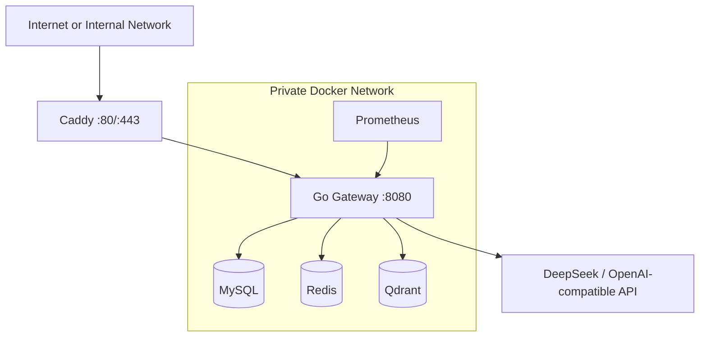

# 架构说明

本项目是一个可部署的 LLM Agent 安全工具调用网关。核心设计点是：LLM 不直接访问内部系统，只输出工具调用意图；Go Gateway 负责校验、授权、执行、审计和观测。

## 系统视图

## 工具执行链路

## RAG 链路

## 部署视图

## 简历表达重点

- LLM 不能直接访问数据库、Redis、Qdrant、HTTP API 或审计日志，所有能力都先封装成 Tool。
- 每次工具调用都会经过 registry lookup、JSON Schema validation、policy check、timeout、panic recovery、audit logging 和 metrics。
- Qdrant RAG 返回带 `document_id`、`source_path`、`chunk_index` 的检索结果，便于追踪来源。
- Redis 限流、MySQL 审计、Prometheus 指标和 Docker Compose 部署让项目具备可运行、可观测、可演示的完整闭环。
